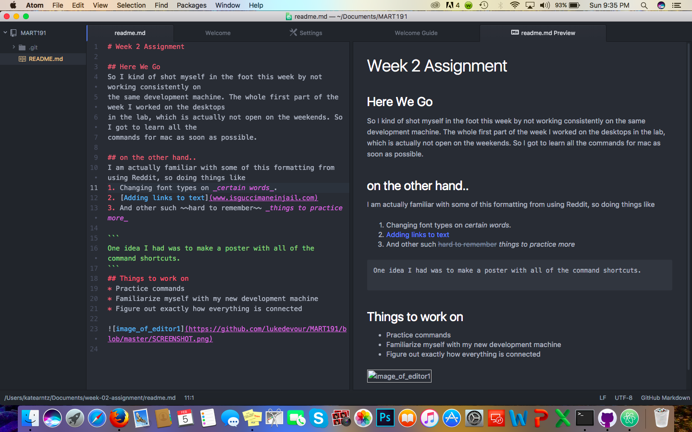

# Week 2 Assignment

## Here We Go
So I kind of shot myself in the foot this week by not working consistently on
the same development machine. The whole first part of the week I worked on the desktops
in the lab, which is actually not open on the weekends. So I got to learn all the
commands for mac as soon as possible.

## on the other hand..
I am actually familiar with some of this formatting from using Reddit, so doing things like
1. Changing font types on _certain words_.
2. [Adding links to text](www.isguccimaneinjail.com)
3. And other such ~~hard to remember~~ _things to practice more_

```
One idea I had was to make a poster with all of the command shortcuts.
```
## Things to work on
* Practice commands
* Familiarize myself with my new development machine
* Figure out exactly how everything is connected


